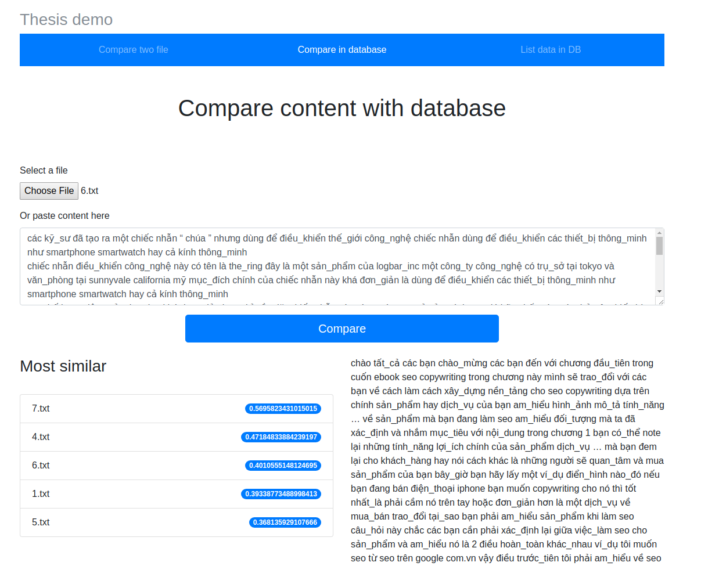

# Demo for compare Doc using Doc2vec

# Install 

1. Install requirement package

```
pip install -r requirements.txt
````

2. Start server 

```
python app.py
```

3. Visit **[http://localhost:8088](http://localhost:8088)**

# Screenshot

1. Compare two document
	

2. Compare document with documents in database
